# NỘI DUNG SLIDE BÁO CÁO ĐỒ ÁN GR2

## Hệ thống RAG Tư vấn Pháp luật Tài chính Nhật Bản cho Người Việt Nam

---

# PHẦN 1: GIỚI THIỆU

---

## SLIDE 1: Trang bìa

**Tiêu đề:** Hệ thống RAG Tư vấn Pháp luật Tài chính Nhật Bản cho Người Việt Nam

**Thông tin:**
- Sinh viên: Phạm Quốc Cường
- Mã số: [Mã SV]
- Giảng viên hướng dẫn: [Tên GVHD]
- Trường: Đại học Bách Khoa Hà Nội
- Thời gian: 2024-2025

---

## SLIDE 2: Đặt vấn đề

**Bối cảnh:**
- 500,000+ người Việt tại Nhật Bản (2024)
- Nhu cầu tìm hiểu pháp luật tài chính cao

**Thách thức:**
- Rào cản ngôn ngữ (tiếng Nhật pháp lý phức tạp)
- Thuật ngữ chuyên ngành: 確定申告, 源泉徴収, 厚生年金
- Thiếu công cụ tra cứu đa ngôn ngữ

**Câu hỏi nghiên cứu:**
> Xây dựng hệ thống cho phép hỏi tiếng Việt → tìm kiếm văn bản tiếng Nhật → trả lời kèm trích dẫn nguồn?

---

## SLIDE 3: Lựa chọn phương pháp

| Phương pháp | Ưu điểm | Nhược điểm |
|-------------|---------|------------|
| **Fine-tuning LLM** | Không cần retrieval | Chi phí cao, kiến thức "đóng băng" |
| **BM25 (từ khóa)** | Đơn giản, nhanh | Không hiểu ngữ nghĩa |
| **RAG ✅** | Cập nhật dễ, có trích dẫn | Phức tạp hơn |

**Lựa chọn:** RAG (Retrieval-Augmented Generation)
- ✅ Trích dẫn nguồn chính xác
- ✅ Cập nhật dữ liệu linh hoạt
- ✅ Hỗ trợ cross-lingual (Việt → Nhật)

---

## SLIDE 4: Mục tiêu và Phạm vi

**Mục tiêu:**
- Xây dựng chatbot tư vấn pháp luật Việt-Nhật
- Trả lời bằng tiếng Việt kèm trích dẫn nguồn

**Phạm vi dữ liệu:**

| Lĩnh vực | Văn bản pháp luật |
|----------|-------------------|
| Thuế | 所得税法, 地方税法 |
| Bảo hiểm xã hội | 健康保険法, 厚生年金保険法 |
| Đầu tư | NISA, iDeCo |
| Lao động | 労働基準法, 労働契約法 |

**Kết quả:** 431 văn bản luật • 206,014 chunks

---

# PHẦN 2: TỔNG QUAN HỆ THỐNG

---

## SLIDE 5: Kiến trúc tổng quan - Luồng hoạt động

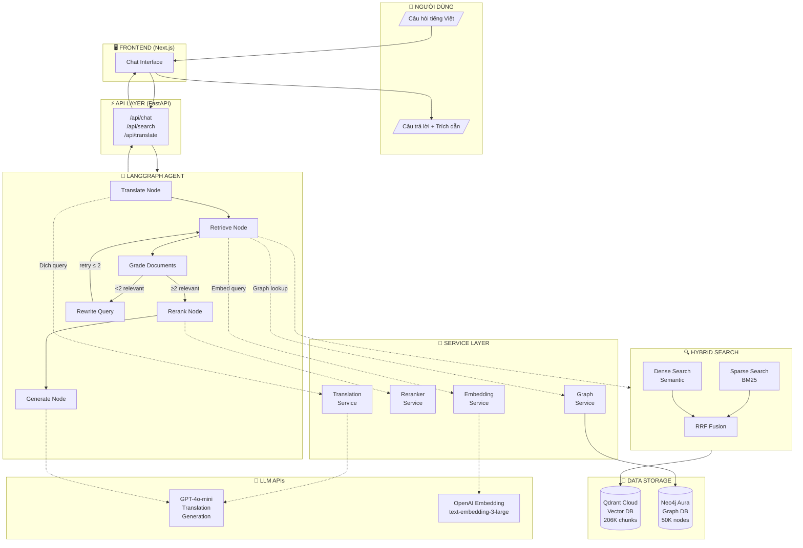

---

## SLIDE 6: Kiến trúc chi tiết - Online vs Offline Pipeline

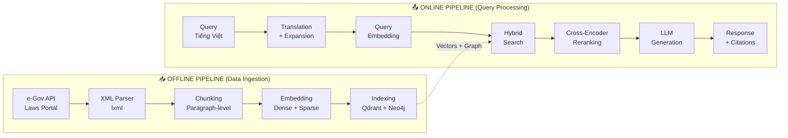

---

## SLIDE 7: Các thành phần chính

| Thành phần | Công nghệ | Chức năng |
|------------|-----------|-----------|
| **Frontend** | Next.js 14 | Chat UI, hiển thị nguồn |
| **Backend** | FastAPI | REST API, orchestration |
| **Vector DB** | Qdrant Cloud | Hybrid search |
| **Graph DB** | Neo4j Aura | Entity lookup, traversal |
| **LLM** | GPT-4o-mini | Translation, generation |
| **Embedding** | text-embedding-3-large | Multilingual vectors |
| **Reranker** | mMarco-mMiniLM | Cross-encoder ranking |
| **Agent** | LangGraph | Self-correction loop |

---

# PHẦN 3: XỬ LÝ DỮ LIỆU

---

## SLIDE 8: Thu thập dữ liệu từ e-Gov API

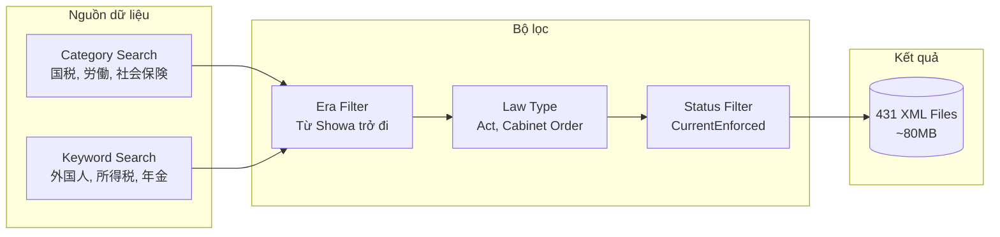

**Rate Limiting:** 1.2s/request • Retry với exponential backoff

---

## SLIDE 9: XML Parsing và Chunking

**Cấu trúc văn bản luật Nhật:**
```
Law → Part (編) → Chapter (章) → Section (節) 
    → Article (条) → Paragraph (項) → Item (号)
```

**Chiến lược Chunking: Paragraph-level**

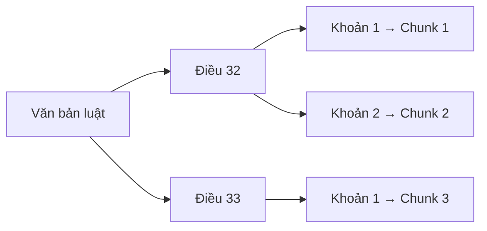

**Context Enrichment:**
```
text: "使用者は、労働者に..."
text_with_context: "労働基準法 第三十二条 (労働時間) 使用者は..."
```

---

## SLIDE 10: Embedding và Indexing

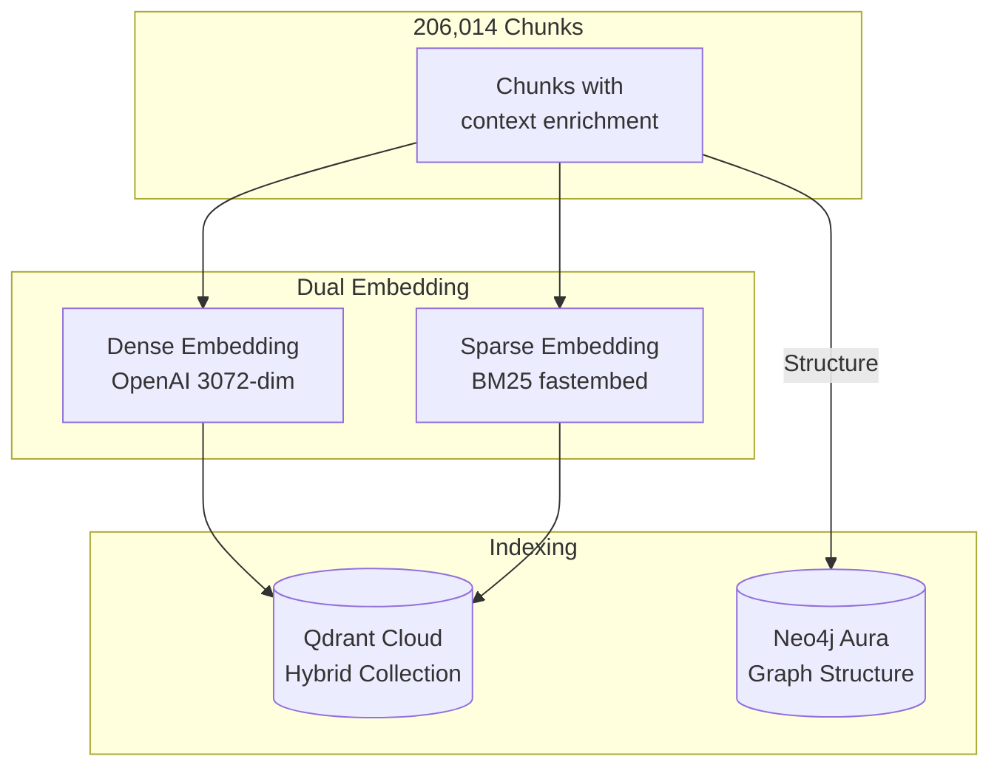

| Loại | Model | Đặc điểm |
|------|-------|----------|
| Dense | text-embedding-3-large | 3072-dim, multilingual |
| Sparse | Qdrant/bm25 | IDF weighting, exact match |

---

## SLIDE 11: Knowledge Graph Schema

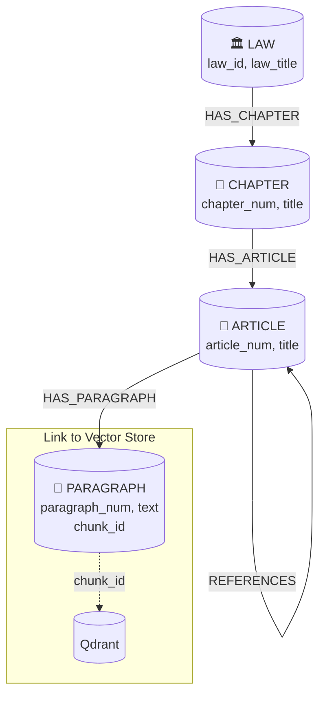

**chunk_id** liên kết Graph ↔ Vector Store

---

# PHẦN 4: HỆ THỐNG TRUY VẤN

---

## SLIDE 12: Query Translation & Expansion

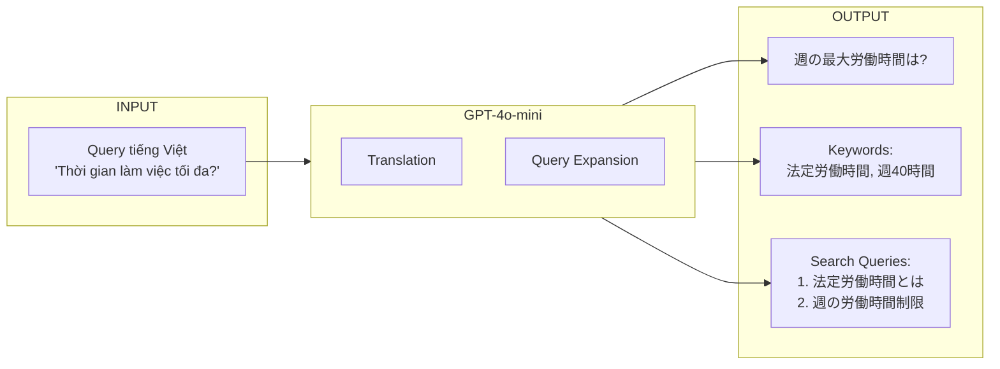

**Multi-Query:** 1 query gốc → 3-5 search queries

---

## SLIDE 13: Hybrid Search với RRF Fusion

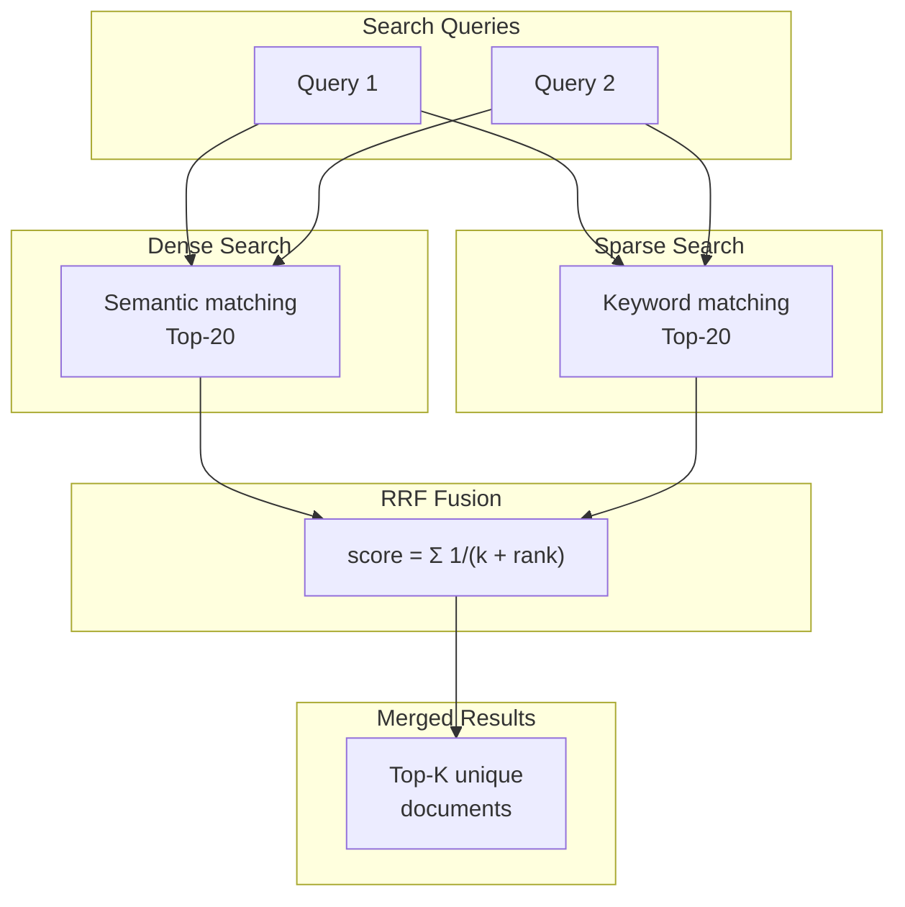

| Search | Ưu điểm | Nhược điểm |
|--------|---------|------------|
| Dense | Hiểu ngữ nghĩa | Miss exact keywords |
| Sparse | Khớp từ chính xác | Không hiểu synonym |
| **Hybrid** | **Kết hợp cả hai** | ✅ |

---

## SLIDE 14: Two-Stage Retrieval với Reranking

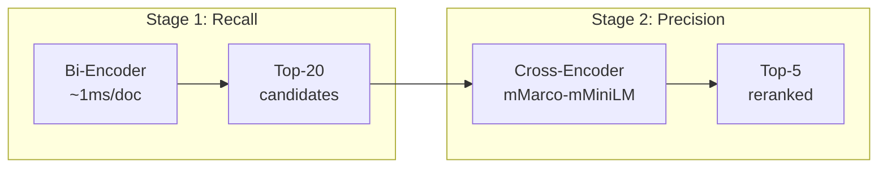

**Cross-Encoder improvement:**

| Query Type | Without | With | Δ |
|------------|---------|------|---|
| Semantic matching | 0.65 | 0.81 | **+16%** |
| Cross-lingual | 0.52 | 0.84 | **+32%** |
| Multi-concept | 0.58 | 0.79 | **+21%** |

---

# PHẦN 5: SINH CÂU TRẢ LỜI

---

## SLIDE 15: LangGraph Agent - State Machine

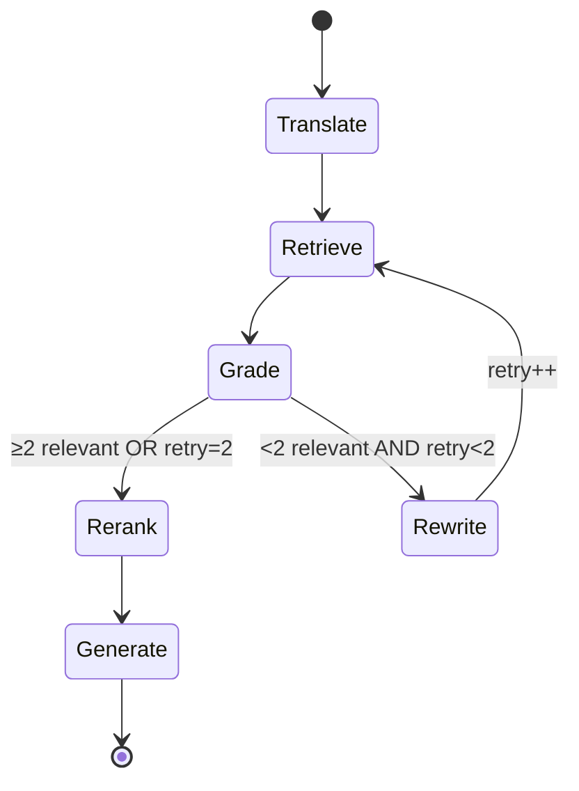

**Self-correction loop:** Nếu retrieval kém → Rewrite query (max 2 lần)

---

## SLIDE 16: LangGraph Nodes

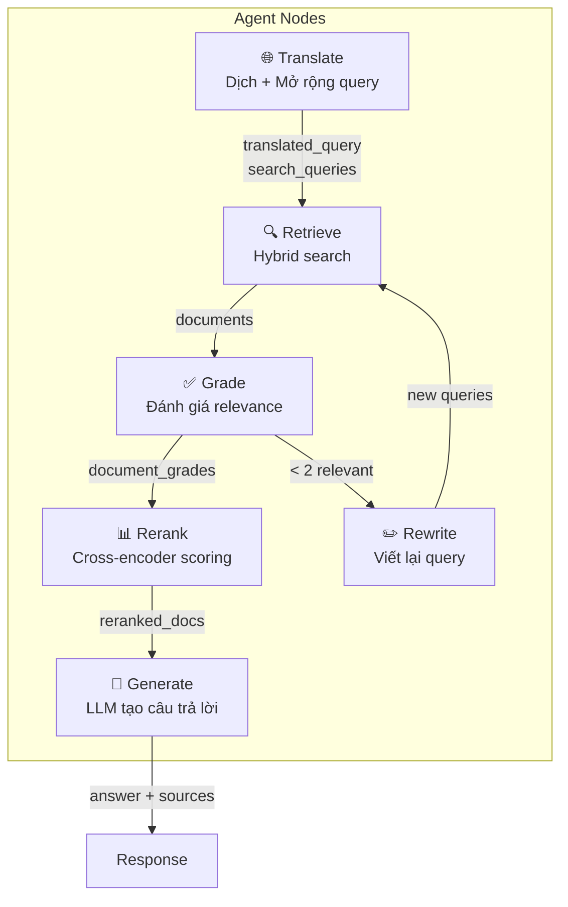

---

## SLIDE 17: LLM Generation với Citation

**Prompt Engineering:**
```
Bạn là chuyên gia tư vấn pháp luật Nhật Bản.
- Trả lời bằng tiếng Việt
- Giữ thuật ngữ Nhật trong ngoặc []
- Trích dẫn nguồn bằng [1], [2]...

Nguồn:
[1] 労働基準法 第三十二条: "使用者は..."
```

**Output:**
> Theo Luật Tiêu chuẩn Lao động [労働基準法], thời gian làm việc tối đa là **40 giờ/tuần** [1].
>
> **Nguồn:** Điều 32 [第三十二条]

---

# PHẦN 6: ĐÁNH GIÁ

---

## SLIDE 18: RAGAS Evaluation Framework

**RAGAS Metrics:**

| Metric | Đo lường | Score |
|--------|----------|-------|
| Context Precision | % retrieved docs relevant | 0.72 |
| Context Recall | % ground truth covered | 0.68 |
| **Faithfulness** | **% answer grounded** | **0.85** ✅ |
| Answer Relevancy | % answer addresses query | 0.78 |

**Test Dataset:** 50 samples • 5 lĩnh vực • 3 mức độ khó

---

## SLIDE 19: So sánh Configurations

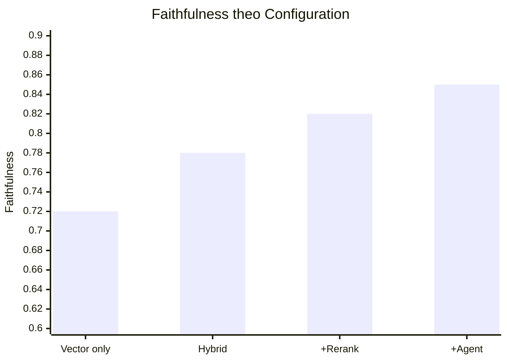

| Configuration | Faithfulness | Latency |
|---------------|--------------|---------|
| Vector only | 0.72 | 2.8s |
| Hybrid search | 0.78 (+8%) | 3.5s |
| + Reranking | 0.82 (+5%) | 7.2s |
| **+ Agent** | **0.85 (+4%)** | **9.5s** |

---

## SLIDE 20: Latency Breakdown

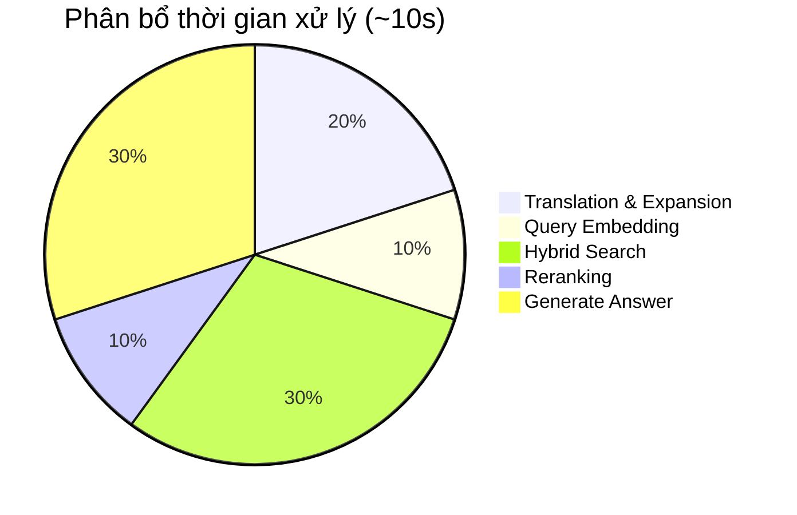

| Bước | Thời gian | Tỷ lệ |
|------|-----------|-------|
| Translation | 2s | 20% |
| Embedding | 1s | 10% |
| Hybrid Search | 3s | 30% |
| Reranking | 1s | 10% |
| Generation | 3s | 30% |

---

# PHẦN 7: KẾT LUẬN VÀ HƯỚNG PHÁT TRIỂN

---

## SLIDE 21: Những gì đã đạt được

**Kết quả:**
- ✅ End-to-end RAG pipeline hoàn chỉnh
- ✅ 431 văn bản luật, 206,014 chunks
- ✅ Cross-lingual retrieval (Việt → Nhật)
- ✅ Hybrid search + Reranking + LangGraph
- ✅ **Faithfulness 0.85** trên RAGAS

**Bài học kỹ thuật:**
1. **Data quality > Model size**
2. **Hybrid approach > Single method**
3. **Right model selection** quan trọng

---

## SLIDE 22: Hạn chế và Hướng phát triển

**Hạn chế:**
- Latency: 8-10s (chậm hơn ChatGPT)
- Coverage: 431 luật, còn thiếu nhiều lĩnh vực
- Không có conversation memory

**Hướng phát triển:**

| Hướng | Cải tiến |
|-------|----------|
| Retrieval | Adaptive chunking, fine-tuned embedding |
| RAG Architecture | CRAG, Self-RAG, Agentic RAG |
| GraphRAG | NER enhancement, multi-hop reasoning |
| Optimization | Redis caching, speculative retrieval |

---

## SLIDE 23: Tổng kết

> **Mục tiêu đã hoàn thành:** Xây dựng công cụ giúp người Việt Nam tại Nhật Bản tiếp cận thông tin pháp luật dễ dàng hơn, bằng tiếng Việt, với trích dẫn nguồn chính xác.

**Đóng góp chính:**
- Pipeline thu thập & xử lý 431 văn bản luật từ e-Gov API
- Hybrid search với RRF fusion
- Two-stage retrieval với cross-encoder
- LangGraph agent với self-correction loop
- Đạt **Faithfulness 0.85**

---

## SLIDE 24: Q&A

**Cảm ơn thầy/cô và các bạn đã lắng nghe!**

**Câu hỏi?**

---

# PHỤ LỤC

## Danh sách hình cần chèn

| Slide | Nội dung hình |
|-------|---------------|
| 5 | Kiến trúc tổng quan - Luồng hoạt động (Mermaid) |
| 6 | Online vs Offline Pipeline (Mermaid) |
| 8 | Thu thập dữ liệu flowchart (Mermaid) |
| 9 | Chunking strategy (Mermaid) |
| 10 | Embedding & Indexing (Mermaid) |
| 11 | Knowledge Graph Schema (Mermaid) |
| 12 | Query Translation flow (Mermaid) |
| 13 | Hybrid Search với RRF (Mermaid) |
| 14 | Two-Stage Retrieval (Mermaid) |
| 15 | LangGraph State Machine (Mermaid) |
| 16 | Agent Nodes flowchart (Mermaid) |
| 19 | Faithfulness comparison chart |
| 20 | Latency pie chart (Mermaid) |
