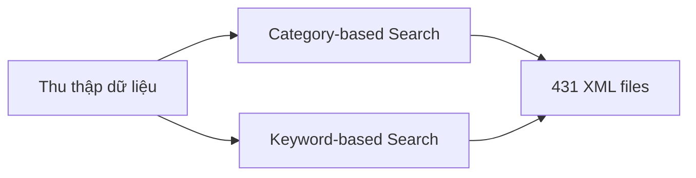
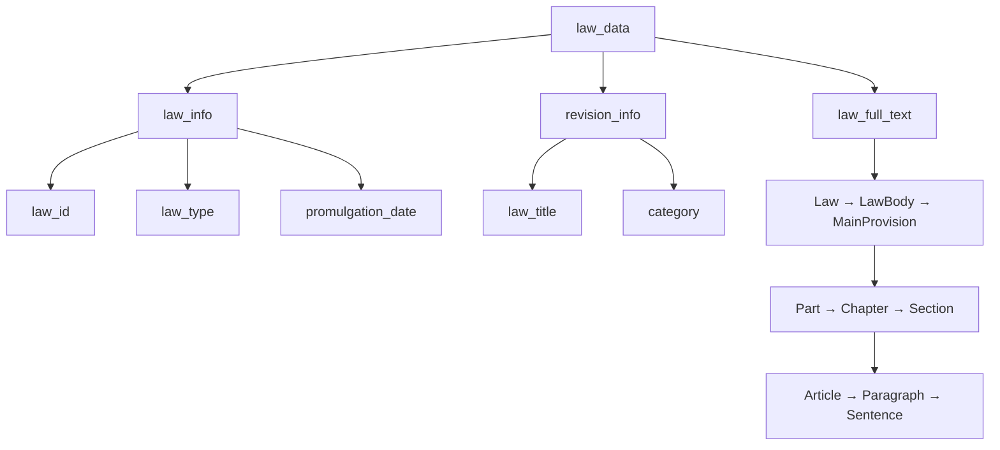
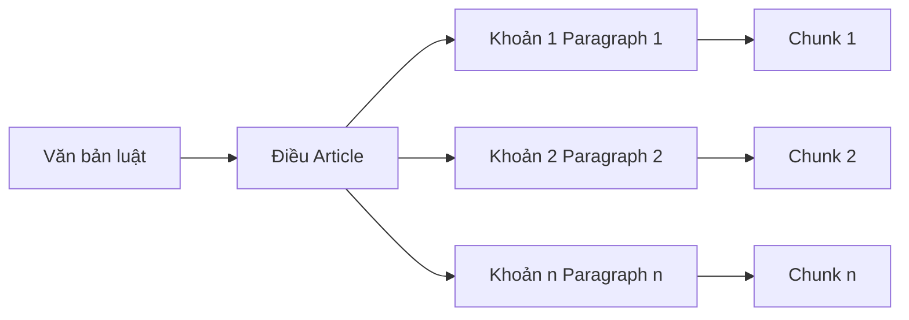
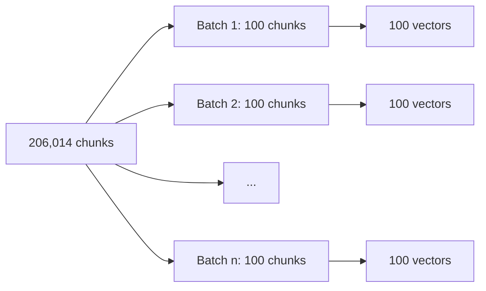
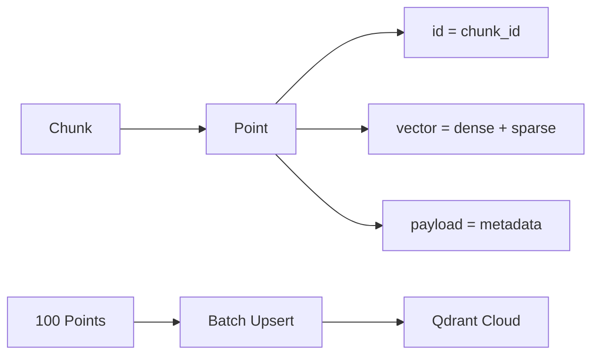
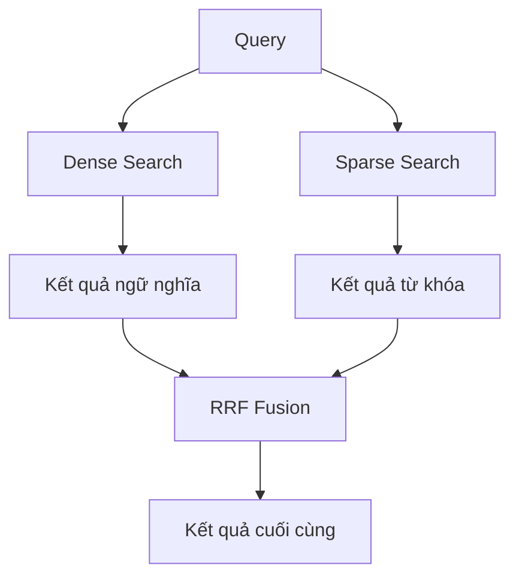
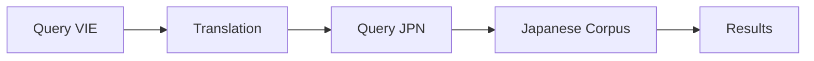
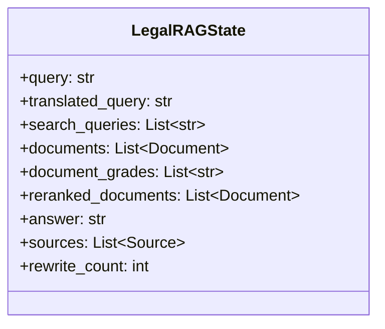
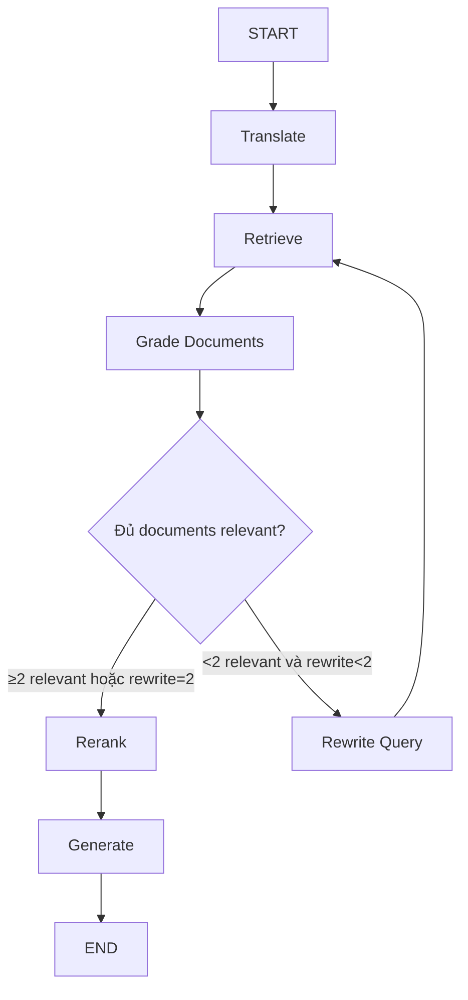
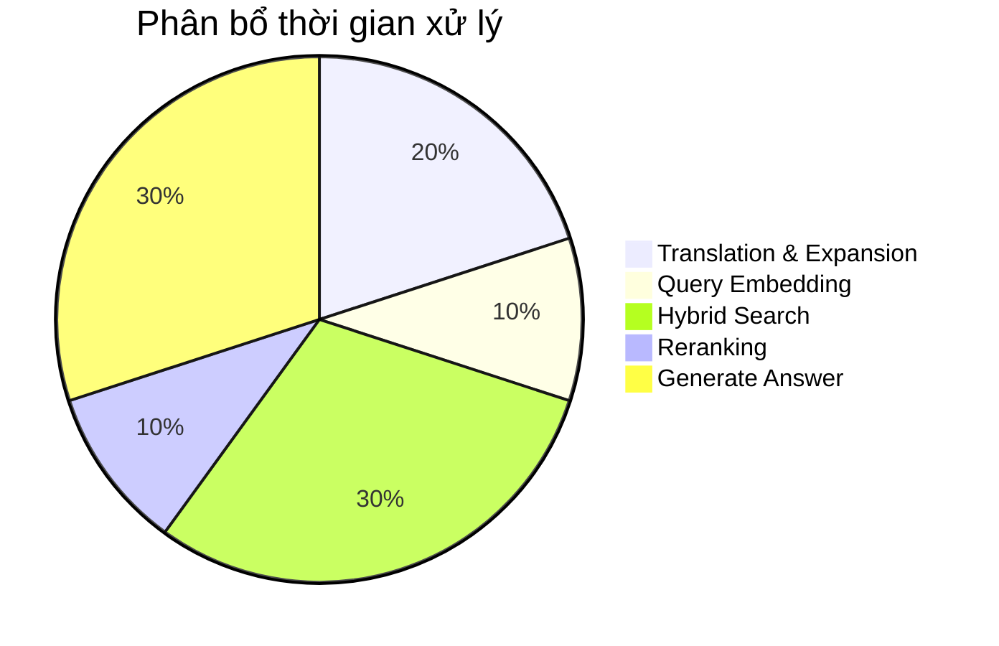

# CHƯƠNG 4: TRIỂN KHAI HỆ THỐNG

Chương 3 đã trình bày thiết kế chi tiết của hệ thống. Chương này sẽ mô tả quá trình triển khai từng thành phần:

| Phần | Nội dung |
|------|----------|
| 4.1  | Thu thập và xử lý dữ liệu |
| 4.2  | Triển khai hệ thống Embedding |
| 4.3  | Triển khai hệ thống truy vấn |
| 4.4  | Triển khai LangGraph Agent |
| 4.5  | Thư viện và công cụ sử dụng |
| 4.6  | Kết quả đạt được |

---

## 4.1. Thu thập và xử lý dữ liệu

### 4.1.1. Thu thập dữ liệu từ e-Gov API

#### Phân tích API

Hệ thống e-Gov Laws API của Nhật Bản cung cấp 3 endpoint chính:

| Endpoint | Phương thức | Chức năng |
|----------|-------------|-----------|
| `/laws` | GET | Lấy danh sách văn bản luật theo danh mục (category) |
| `/keyword` | GET | Tìm kiếm văn bản luật theo từ khóa |
| `/law_data/{law_id}` | GET | Tải nội dung XML đầy đủ của văn bản luật |

> **Giới hạn**: ~50 requests/phút

#### Chiến lược thu thập



**1. Category-based Search (Tìm kiếm theo danh mục)**:
- 国税 (Thuế quốc gia)
- 地方財政 (Tài chính địa phương)
- 社会保険 (Bảo hiểm xã hội)
- 労働 (Lao động)

**2. Keyword-based Search (Tìm kiếm theo từ khóa)**:
- 外国人 (Người nước ngoài)
- 在留 (Cư trú)
- 所得税 (Thuế thu nhập)
- 年金 (Lương hưu)
- 健康保険 (Bảo hiểm y tế)

#### Bộ lọc chất lượng

| Loại bộ lọc | Điều kiện | Mục đích |
|------------|-----------|----------|
| **Era filter** | Ban hành từ thời Showa (1926) trở về sau | Loại bỏ văn bản quá cũ |
| **Law type filter** | Act (法律) hoặc Cabinet Order (政令) | Tập trung văn bản quan trọng |
| **Status filter** | CurrentEnforced (現行有効) | Chỉ lấy văn bản đang có hiệu lực |

#### Xử lý giới hạn tần suất (Rate Limiting)

- **Độ trễ giữa các request**: 1.2 giây
- **Chiến lược retry khi gặp lỗi**:
  - Lần 1: Chờ 5 giây
  - Lần 2: Chờ 10 giây
  - Lần 3: Chờ 20 giây
- **Nếu vẫn thất bại**: Ghi log lỗi → Tiếp tục với văn bản tiếp theo

#### Kết quả thu thập

| Metric | Giá trị |
|--------|---------|
| Số file XML | 431 |
| Tổng dung lượng | ~80MB |

---

### 4.1.2. Phân tích cấu trúc XML

#### Cấu trúc văn bản luật e-Gov



#### Triển khai bộ phân tích XML

**Thư viện sử dụng**: `lxml` (Python)

**Quy trình parse**:
1. Trích xuất metadata từ `law_info` và `revision_info`
2. Duyệt tất cả phần tử `Article` trong `MainProvision`
3. Với mỗi Article → Trích xuất các `Paragraph` kèm nội dung

**Output**: Dictionary lồng nhau (nested dict)

---

### 4.1.3. Triển khai Chunking

#### Chiến lược Paragraph-level Chunking



**Lý do chọn paragraph-level**:
- ✅ Đảm bảo tính nguyên vẹn ngữ nghĩa (mỗi khoản = 1 ý hoàn chỉnh)
- ✅ Phù hợp với context window của mô hình embedding
- ✅ Thuận tiện cho việc trích dẫn nguồn chính xác

#### Context Enrichment

| Trường | Nội dung | Mục đích |
|--------|----------|----------|
| `text` | Nội dung gốc của khoản | Hiển thị cho người dùng |
| `text_with_context` | Tên luật + Số điều + Tiêu đề điều + Nội dung | Dùng cho embedding |

**Metadata của mỗi chunk**:
- `chunk_id`: Mã định danh duy nhất
- `law_id`: Mã văn bản luật gốc
- `law_title`: Tên văn bản luật
- `article_num`, `article_title`: Số điều và tiêu đề
- `paragraph_num`: Số khoản
- `text`, `text_with_context`: Nội dung

#### Thống kê kết quả Chunking

| Metric | Giá trị |
|--------|---------|
| Tổng số chunks | 206,014 |
| Kích thước trung bình | ~171 ký tự (~85 tokens) |
| Chunk ngắn nhất | 10 ký tự |
| Chunk dài nhất | 2,500 ký tự |

---

## 4.2. Triển khai hệ thống Embedding

### 4.2.1. Dense Embedding với OpenAI

#### Lựa chọn mô hình

| Mô hình | Kích thước vector | Ưu điểm |
|---------|-------------------|---------|
| `text-embedding-3-large` | 3,072 chiều | Hỗ trợ đa ngôn ngữ (Nhật, Việt) tốt |

#### Xử lý theo Batch



- **Batch size**: 100 chunks/request
- **Mục đích**: Giảm thời gian và chi phí API

#### Cơ chế Checkpoint

- **Lưu checkpoint**: Sau mỗi văn bản luật xử lý xong
- **Khôi phục**: Tiếp tục từ checkpoint nếu bị gián đoạn
- **Dữ liệu checkpoint**: Chỉ số văn bản + Tất cả embedding đã có

---

### 4.2.2. Sparse Embedding với fastembed

#### So sánh Dense vs Sparse Embedding

| Đặc điểm | Dense Embedding | Sparse Embedding |
|----------|-----------------|------------------|
| Biểu diễn | Vector dày (dense) | Vector thưa (sparse) |
| Tìm kiếm | Ngữ nghĩa (semantic) | Từ khóa (keyword) |
| Thuật toán | Neural network | BM25 |
| Ưu điểm | Hiểu nghĩa tương đồng | Khớp từ chính xác |

#### Triển khai

- **Thư viện**: `fastembed`
- **Mô hình**: `Qdrant/bm25`
- **Đặc điểm**: Chạy offline, không cần API

**Cấu trúc output**:
- `indices`: Vị trí các từ trong vocabulary
- `values`: Trọng số BM25 tương ứng

---

### 4.2.3. Indexing vào Qdrant

#### Thiết lập Collection

| Cấu hình | Dense Vector | Sparse Vector |
|----------|--------------|---------------|
| Kích thước | 3,072 chiều | Động (vocabulary size) |
| Metric | Cosine Similarity | IDF modifier |
| Collection name | `japanese_laws_hybrid` | |

#### Quy trình Upsert



- **Batch size**: 100 points
- **Tổng thời gian indexing**: ~2 giờ

---

## 4.3. Triển khai hệ thống truy vấn

### 4.3.1. Hybrid Search với RRF

#### Nguyên lý hoạt động



| Loại Search | Ưu điểm | Nhược điểm |
|-------------|---------|------------|
| Dense Search | Tìm nghĩa tương đồng | Có thể bỏ sót từ khóa quan trọng |
| Sparse Search | Khớp từ chính xác | Không hiểu ngữ nghĩa |
| **Hybrid** | **Kết hợp cả hai ưu điểm** | |

#### Triển khai với Qdrant Prefetch

**Giai đoạn 1 - Prefetch**:
- Dense search: Lấy `top_k × 2` kết quả
- Sparse search: Lấy `top_k × 2` kết quả

**Giai đoạn 2 - Fusion (RRF)**:
```
score = 1/(k + rank_dense) + 1/(k + rank_sparse)
```
- `k = 60` (tham số điều chỉnh)
- Sắp xếp theo score → Lấy `top_k`

---

### 4.3.2. Cross-Encoder Reranking

#### So sánh Bi-Encoder vs Cross-Encoder

| Đặc điểm | Bi-Encoder | Cross-Encoder |
|----------|------------|---------------|
| Input | Query và Document riêng biệt | (Query, Document) cùng nhau |
| Tốc độ | Nhanh | Chậm hơn |
| Độ chính xác | Tốt | **Tốt hơn** |
| Sử dụng | Retrieval (giai đoạn 1) | Reranking (giai đoạn 2) |

#### Triển khai

- **Mô hình**: `cross-encoder/mmarco-mMiniLMv2-L12-H384-v1`
- **Thư viện**: `sentence-transformers`
- **Đặc điểm**: Đa ngôn ngữ, hỗ trợ tiếng Nhật

**Quy trình Reranking**:
1. Nhận danh sách documents từ Hybrid Search
2. Tạo các cặp `(query, document.text_with_context)`
3. Đưa qua Cross-Encoder → Điểm relevance
4. Sắp xếp theo điểm (cao → thấp)
5. Lấy top-n documents (thường là 5)

---

### 4.3.3. Query Translation và Expansion

#### Vấn đề Cross-lingual Retrieval



- **Vấn đề**: Người dùng hỏi tiếng Việt, corpus là tiếng Nhật
- **Giải pháp**: Dịch query sang tiếng Nhật trước khi search

#### Triển khai với GPT-4o-mini

**3 nhiệm vụ thực hiện đồng thời**:
1. **Dịch query**: Tiếng Việt → Tiếng Nhật
2. **Trích xuất keywords**: Các từ khóa pháp lý quan trọng
3. **Mở rộng query**: Tạo biến thể search query

**Ví dụ**:

| Đầu vào | Đầu ra |
|---------|--------|
| "Thời gian làm việc tối đa mỗi tuần là bao nhiêu?" | |
| `translated` | "一週間の最大労働時間は何時間ですか?" |
| `keywords` | ["労働時間", "労働基準法"] |
| `search_queries` | ["週労働時間上限", "一週間労働時間制限"] |

---

## 4.4. Triển khai LangGraph Agent

### 4.4.1. Thiết kế State

#### Cấu trúc LegalRAGState



| Trường | Kiểu dữ liệu | Mô tả |
|--------|--------------|-------|
| `query` | str | Câu hỏi gốc (tiếng Việt) |
| `translated_query` | str | Câu hỏi đã dịch (tiếng Nhật) |
| `search_queries` | List[str] | Các query mở rộng |
| `documents` | List[Document] | Documents từ retrieval |
| `document_grades` | List[str] | Đánh giá relevance |
| `reranked_documents` | List[Document] | Documents sau rerank |
| `answer` | str | Câu trả lời |
| `sources` | List[Source] | Nguồn tham khảo |
| `rewrite_count` | int | Số lần rewrite query |

---

### 4.4.2. Triển khai các Node

#### Danh sách các Node

| Node | Input | Output | Chức năng |
|------|-------|--------|-----------|
| **Translate** | query | translated_query, search_queries | Dịch và mở rộng query |
| **Retrieve** | search_queries | documents | Hybrid search trên Qdrant |
| **Grade Documents** | documents, query | document_grades | Đánh giá relevance từng document |
| **Rerank** | documents (relevant) | reranked_documents | Cross-encoder reranking |
| **Generate** | reranked_documents, query | answer, sources | Tạo câu trả lời với LLM |
| **Rewrite Query** | query, documents | search_queries mới | Điều chỉnh query khi retrieval kém |

#### Chi tiết các Node

**Translate Node**:
- Sử dụng GPT-4o-mini
- Output: `translated_query` + `search_queries`

**Retrieve Node**:
- Thực hiện hybrid search với mỗi query
- Gộp kết quả + Loại bỏ trùng lặp
- Giới hạn: 20 documents unique

**Grade Documents Node**:
- LLM đánh giá từng document
- Kết quả: "relevant" hoặc "not_relevant"

**Rerank Node**:
- Lọc documents "relevant"
- Cross-encoder reranking
- Sắp xếp theo relevance score

**Generate Node**:
- Sử dụng GPT-4o-mini
- Trả lời bằng tiếng Việt
- Kèm trích dẫn nguồn

**Rewrite Query Node**:
- Phân tích nguyên nhân retrieval kém
- Đề xuất query mới
- Tăng `rewrite_count`

---

### 4.4.3. Xây dựng Graph

#### Luồng xử lý (Workflow)



#### Conditional Edge Logic

```
if (relevant_docs >= 2) OR (rewrite_count >= 2):
    → Chuyển đến "Rerank"
else:
    → Chuyển đến "Rewrite Query"
```

- **Giới hạn rewrite**: Tối đa 2 lần
- **Mục đích**: Tránh vòng lặp vô tận

---

## 4.5. Thư viện và công cụ sử dụng

### Backend

| Thư viện | Phiên bản | Chức năng |
|----------|-----------|-----------|
| FastAPI | 0.109.0 | Web framework, API endpoints |
| httpx | 0.26.0 | HTTP client bất đồng bộ |
| lxml | 5.1.0 | Parse và xử lý XML |
| openai | 1.10.0 | OpenAI API (embedding + LLM) |
| qdrant-client | 1.7.0 | Vector database client |
| fastembed | 0.2.0 | Sparse embedding (BM25) |
| neo4j | 5.16.0 | Knowledge Graph database |
| sentence-transformers | 2.3.0 | Cross-encoder reranking |
| langgraph | 0.0.26 | Agent workflow orchestration |

### Frontend

| Thư viện | Phiên bản | Chức năng |
|----------|-----------|-----------|
| Next.js | 14.0.0 | React framework, SSR |

---

## 4.6. Kết quả đạt được

### 4.6.1. Thống kê hệ thống

| Thành phần | Metric | Giá trị |
|------------|--------|---------|
| **Vector Database** | Số văn bản luật | 431 |
| | Số chunks | 206,014 |
| | Dung lượng | ~2.5GB |
| **Knowledge Graph** | Số nodes | ~50,000 |
| | Số relationships | ~100,000 |

---

### 4.6.2. Phân tích độ trễ

#### Breakdown thời gian xử lý (Query điển hình: ~10 giây)

| Bước | Thời gian | Tỷ lệ | Chi tiết |
|------|-----------|-------|----------|
| Translation & Expansion | 2s | 20% | API call đến OpenAI |
| Query Embedding | 1s | 10% | Embedding các query mở rộng |
| Hybrid Search | 3s | 30% | Search trên Qdrant Cloud |
| Reranking | 1s | 10% | Cross-encoder (CPU local) |
| Generate Answer | 3s | 30% | LLM generate response |
| **Tổng** | **10s** | **100%** | |



---

### 4.6.3. Minh họa chức năng

#### Ví dụ: Query về thời gian làm việc

**Input**: "Thời gian làm việc tối đa mỗi tuần là bao nhiêu?"

**Pipeline xử lý**:
1. **Translate**: → "一週間の最大労働時間は何時間ですか?"
2. **Retrieve**: → Tìm các điều khoản trong 労働基準法
3. **Rerank**: → Chọn Điều 32 là relevant nhất
4. **Generate**: → Tạo câu trả lời tiếng Việt

**Output**:

| Phần | Nội dung |
|------|----------|
| **Câu trả lời** | "Theo Luật Tiêu chuẩn Lao động (労働基準法), thời gian làm việc tối đa là **40 giờ/tuần** và **8 giờ/ngày**." |
| **Nguồn** | Điều 32, Luật Tiêu chuẩn Lao động |
| **Trích dẫn** | 「使用者は、労働者に、休憩時間を除き一週間について四十時間を超えて、労働させてはならない。」 |
| **Dịch nghĩa** | "Người sử dụng lao động không được bắt người lao động làm việc quá 40 giờ một tuần, không tính thời gian nghỉ." |

---

## Kết chương

### Tổng kết các thành phần đã triển khai

| Thành phần | Kết quả |
|------------|---------|
| **Thu thập dữ liệu** | 431 văn bản luật từ e-Gov API |
| **Chunking** | 206,014 chunks với context enrichment |
| **Embedding** | Dense (OpenAI) + Sparse (BM25) |
| **Vector DB** | Qdrant Cloud với hybrid search |
| **Retrieval** | Hybrid Search + RRF + Cross-encoder Reranking |
| **Agent** | LangGraph với self-correction loop |
| **Latency** | ~10 giây/query |

### Điểm nổi bật

- ✅ Pipeline xử lý dữ liệu hoàn chỉnh (thu thập → chunking → embedding → indexing)
- ✅ Hybrid search kết hợp dense + sparse cho độ chính xác cao
- ✅ Cross-encoder reranking cải thiện kết quả retrieval
- ✅ Self-correction loop xử lý query phức tạp
- ✅ Hệ thống sẵn sàng cho sử dụng thực tế

> **Chương tiếp theo** sẽ đánh giá chi tiết hiệu quả của hệ thống với framework RAGAS.
